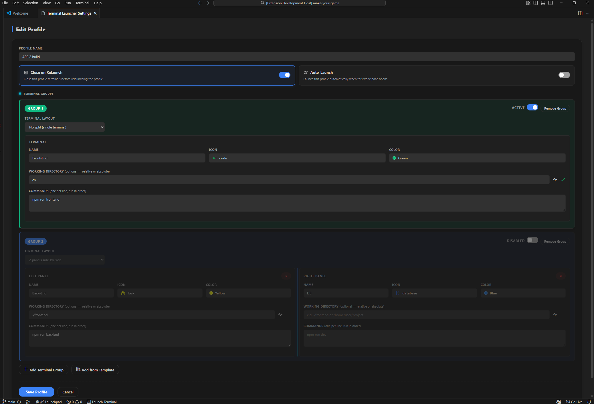
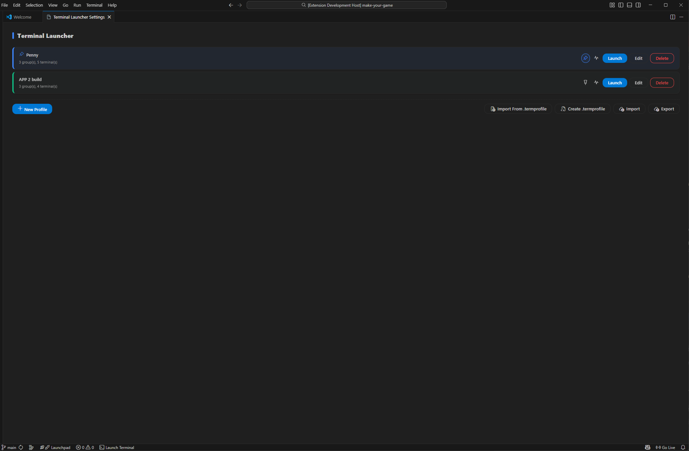
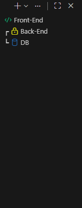

# Terminal Launcher — VS Code Extension

[](https://github.com/sponsors/Ali-H-M)

Save and launch sets of pre-configured terminals with a single command. Open multiple tabs, split panels, auto-run commands, and keep everything organized with named profiles.

## Features

- **Multiple terminals** — open several terminal tabs at once
- **Auto-run commands** — each terminal runs its commands automatically on launch
- **Split terminals** — up to 4 panels side-by-side, each with its own commands
- **Custom icons & colors** — assign any VS Code icon and color for easy identification
- **Saveable profiles** — name and save configurations, switch between projects instantly
- **Import / Export** — back up profiles to JSON and share them across machines
- **Path health checks** — verify that all `cwd` paths in a profile exist/valid at any time
- **Team profiles via `.termprofile`** — commit a shared profile file to your repo so the whole team gets the same terminal setup automatically

## Usage

Open the Command Palette (`Ctrl+Shift+P`) or click **$(terminal) Launch Terminal** in the status bar.

| Command                              | Description                        |
| ------------------------------------ | ---------------------------------- |
| `Terminal Launcher: Quick Launch`    | Pick a saved profile and launch it |
| `Terminal Launcher: Open Settings`   | Create and manage profiles         |
| `Terminal Launcher: Export Profiles` | Save all profiles to a JSON file   |
| `Terminal Launcher: Import Profiles` | Load profiles from a JSON file     |

## Keyboard Shortcut

Quick Launch can be assign to Keyboard Shortcut:

1. Go to **File** → **Preferences** → **Keyboard Shortcuts**
2. Search `Terminal Launcher: Quick Launch`
3. Click the `+` icon and press your preferred key combination

## Creating a Profile

1. Run **Terminal Launcher: Open Settings**
2. Click **+ New Profile**
3. Enter a profile name
4. Configure terminal groups:
   - Choose a **Terminal Layout** (1–4 split panels)
   - Set a name, icon, and color for each panel
   - Enter commands (one per line) that auto-run on launch
5. Optionally enable **Close previous terminals when relaunching**
6. Click **Save Profile**

## Screenshots

### Profile Configuration



### Profile Manager



### Running Terminals



## Team Profiles — `.termprofile`

The `.termprofile` file lets you define terminal profiles at the repo level, similar to how `.gitignore` works for Git. Commit it to version control and every team member gets the same terminal setup when they open the project (extension is needed).

### Creating a `.termprofile`

**From the Settings panel:** click **Create .termprofile**. A multi-select picker lets you choose which of your saved profiles to include. The file get created at the workspace root.

**Manual:** click **Import From .termprofile** in the Settings panel footer. You'll be asked whether to merge with or replace your existing profiles.

### Recommending the extension to your team

Add a `.vscode/extensions.json` file to your repo so VS Code suggests installing Terminal Launcher when someone clones the project:

```json
{
  "recommendations": ["Ali-H-M.terminal-profile-launcher"]
}
```

### Found a bug or have a suggestion?

Please [open a GitHub issue](https://github.com/your-repo/issues) or email [alixxgam@gmail.com](mailto:alixxgam@gmail.com).
