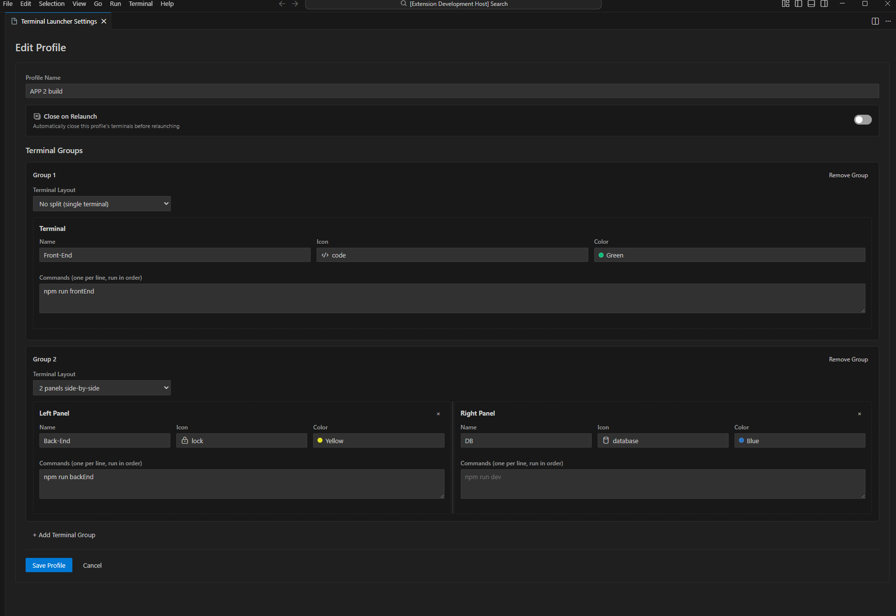
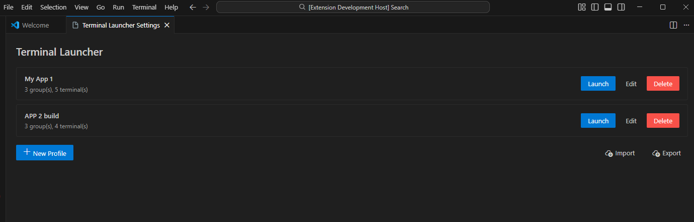
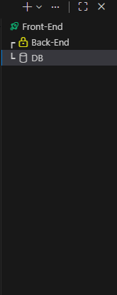

# Terminal Launcher — VS Code Extension

Save and launch sets of pre-configured terminals with a single command. Open multiple tabs, split panels, auto-run commands, and keep everything organized with named profiles.

## Features

- **Multiple terminals** — open several terminal tabs at once with a single command
- **Auto-run commands** — each terminal runs its commands automatically on launch
- **Split terminals** — up to 4 panels side-by-side, each with its own commands
- **Custom icons & colors** — assign any VS Code codicon and color for easy identification
- **Saveable profiles** — name and save configurations, switch between projects instantly
- **Import / Export** — back up profiles to JSON and share them across machines or with teammates
- **Close on relaunch** — optionally close the previous terminals before reopening a profile

## Usage

Open the Command Palette (`Ctrl+Shift+P`) or click **$(terminal) Launch Terminal** in the status bar.

| Command                              | Description                        |
| ------------------------------------ | ---------------------------------- |
| `Terminal Launcher: Quick Launch`    | Pick a saved profile and launch it |
| `Terminal Launcher: Open Settings`   | Create and manage profiles         |
| `Terminal Launcher: Export Profiles` | Save all profiles to a JSON file   |
| `Terminal Launcher: Import Profiles` | Load profiles from a JSON file     |

## Keyboard Shortcut

Quick Launch can be assign to Keyboard Shortcut:

1. Go to **File** → **Preferences** → **Keyboard Shortcuts**
2. Search `Terminal Launcher: Quick Launch`
3. Click the `+` icon and press your preferred key combination

## Creating a Profile

1. Run **Terminal Launcher: Open Settings**
2. Click **+ New Profile**
3. Enter a profile name
4. Configure terminal groups:
   - Choose a **Terminal Layout** (1–4 split panels)
   - Set a name, icon, and color for each panel
   - Enter commands (one per line) that auto-run on launch
5. Optionally enable **Close previous terminals when relaunching**
6. Click **Save Profile**

## Screenshots

### Profile Configuration

### Profile Manager

### Running Terminals

